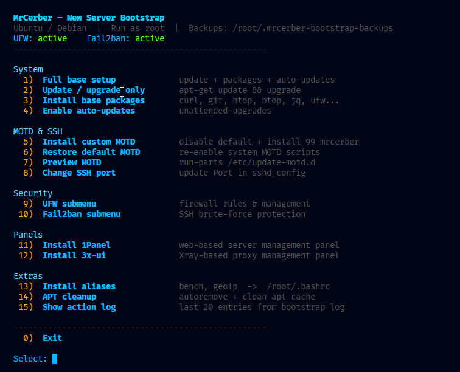

<div align="center">

# 🖥️ Server Tools

**Интерактивный bootstrap-скрипт для свежего сервера Ubuntu / Debian**

[](https://www.gnu.org/software/bash/)
[](https://ubuntu.com/)
[](#)
[](#)

</div>

---

## О проекте

Один скрипт — полная начальная настройка сервера. Устанавливает базовые пакеты, настраивает файрвол, Fail2ban, кастомный MOTD и shell-алиасы. Всё через интерактивное меню с цветным выводом и логированием.

- 📦 Обновляет пакеты и устанавливает базовый набор утилит
- 🔄 Настраивает автоматические security-обновления
- 🛡️ Управляет UFW и Fail2ban через интерактивные подменю
- 🔑 Меняет порт SSH из меню с защитой от ошибок
- 🖥️ Устанавливает кастомный MOTD с системной информацией
- 🗂️ Устанавливает 1Panel или 3x-ui через встроенные установщики
- ⚡ Добавляет полезные алиасы в `.bashrc`
- 🧹 Очищает APT-кэш и удаляет неиспользуемые пакеты
- 📝 Логирует все действия и создаёт резервные копии

---

## Быстрый старт

```bash
bash <(curl -Ls https://raw.githubusercontent.com/MrCerber/Server-Tools/refs/heads/main/install.sh)
```

> [!IMPORTANT]
> Скрипт запускается **от root**. SSH-ключи должны быть установлены заранее.

---

## Требования

| Требование | |
|---|---|
| **ОС** | Ubuntu / Debian *(другие дистрибутивы — на свой страх и риск)* |
| **Права** | root |
| **Интернет** | нужен для установки пакетов и загрузки MOTD |

---

## Скриншот



---

## Меню

При запуске открывается интерактивное цветное меню со статусом сервисов в реальном времени.

<details>
<summary><b>📋 Показать структуру меню</b></summary>
<br>

```
  MrCerber — New Server Bootstrap
  UFW: active        Fail2ban: active
  ────────────────────────────────────────────────────

  System
    1)  Full base setup          update + packages + auto-updates
    2)  Update / upgrade only    apt-get update && upgrade
    3)  Install base packages    curl, git, htop, btop, jq, ufw...
    4)  Enable auto-updates      unattended-upgrades

  MOTD & SSH
    5)  Install custom MOTD      disable default + install 99-mrcerber
    6)  Restore default MOTD     re-enable system MOTD scripts
    7)  Preview MOTD             run-parts /etc/update-motd.d
    8)  Change SSH port          update Port in sshd_config

  Security
    9)  UFW submenu              firewall rules & management
   10)  Fail2ban submenu         SSH brute-force protection

  Panels
   11)  Install 1Panel           web-based server management panel
   12)  Install 3x-ui            Xray-based proxy management panel

  Extras
   13)  Install aliases          bench, geoip  ->  /root/.bashrc
   14)  APT cleanup              autoremove + clean apt cache
   15)  Show action log          last 20 entries from bootstrap log

    0)  Exit
```

</details>

---

## Функции

<details>
<summary><b>📦 Full base setup</b></summary>
<br>

Запускает три шага последовательно и выводит итоговый summary:

1. `apt-get update && apt-get upgrade`
2. Установка базовых пакетов
3. Включение `unattended-upgrades`

**Устанавливаемые пакеты:**

```
ca-certificates  curl        wget       gnupg        lsb-release
unzip            zip         tar        nano         vim
htop             btop        net-tools  iproute2     dnsutils
jq               git         ufw        fail2ban
unattended-upgrades          apt-listchanges          openssh-server
```

</details>

<details>
<summary><b>🖥️ Кастомный MOTD</b></summary>
<br>

При SSH-входе вместо стандартного MOTD отображается:

```
  System
  ────────────────────────────────────────────────────
    Host          server01
    IP            1.2.3.4
    OS            Ubuntu 22.04.3 LTS
    Kernel        5.15.0-91-generic
    Uptime        up 3 days, 2 hours, 15 minutes
    CPU           Intel Xeon E5-2680  (8 cores / 16 threads)
    Load          0.12 / 0.08 / 0.05  (1m/5m/15m)
    Load%         1%  (normalized: 0.01 per thread)
    RAM           1.2G / 8.0G
    Last Login    root from 10.0.0.1 at Mon Jan 6 12:00:00 2025

  Storage
  ────────────────────────────────────────────────────
    Disk /        [████████░░░░░░░░░░░░░░░░]  33%  (16G/48G)

  Services
  ────────────────────────────────────────────────────
    docker: ○ inactive   fail2ban: ● active   ufw: ● active

  Updates
  ────────────────────────────────────────────────────
    Status        System is up to date
```

Файлы `99-mrcerber` и `logo.txt` берутся из папки рядом со скриптом.
Если не найдены — скачиваются автоматически с GitHub.

</details>

<details>
<summary><b>🔑 Смена порта SSH</b></summary>
<br>

Изменяет порт SSH в `/etc/ssh/sshd_config` с автоматическим бэкапом и перезагрузкой сервиса.

> [!WARNING]
> Сначала открой новый порт в UFW (`9)  UFW submenu → Allow custom port`), только потом меняй порт SSH — иначе потеряешь доступ к серверу.

</details>

<details>
<summary><b>🛡️ UFW — управление файрволом</b></summary>
<br>

| Пункт | Действие |
|---|---|
| Status | `ufw status verbose` |
| Apply defaults | `deny incoming` / `allow outgoing` |
| Allow SSH | открыть `22/tcp` |
| Allow HTTP+HTTPS | открыть `80` + `443` |
| Allow custom port | ввести порт и протокол (tcp / udp / both) |
| Delete rule | удалить правило по номеру |
| Enable / Disable | включить / выключить UFW |
| Reset | сбросить все правила *(с подтверждением)* |

</details>

<details>
<summary><b>🚫 Fail2ban — защита SSH</b></summary>
<br>

| Пункт | Действие |
|---|---|
| Install + enable | установить и запустить сервис |
| Configure SSH jail | записать `/etc/fail2ban/jail.local` |
| Status | статус сервиса + sshd jail |
| Unban IP | разбанить IP из sshd jail |

Конфигурация `jail.local` по умолчанию:

```ini
[DEFAULT]
bantime  = 1h
findtime = 10m
maxretry = 5
backend  = systemd
banaction = ufw

[sshd]
enabled = true
mode    = normal
```

</details>

<details>
<summary><b>🧹 APT cleanup</b></summary>
<br>

Освобождает место на диске:

1. `apt-get autoremove` — удаляет неиспользуемые зависимости
2. `apt-get clean` — очищает кэш загруженных пакетов

Выводит размер кэша до и после очистки.

</details>

<details>
<summary><b>🗂️ Panels — 1Panel и 3x-ui</b></summary>
<br>

**1Panel** — современная веб-панель управления сервером с поддержкой Docker, сайтов, баз данных и мониторинга.

```bash
bash -c "$(curl -sSL https://resource.1panel.pro/v2/quick_start.sh)"
```

**3x-ui** — веб-панель управления Xray-core для настройки прокси-протоколов (VLESS, VMess, Trojan и др.).

```bash
bash <(curl -Ls https://raw.githubusercontent.com/mhsanaei/3x-ui/master/install.sh)
```

Оба установщика:
- Запускаются с проверкой интернет-соединения
- Логируют начало и конец установки
- Полностью интерактивны — следуй инструкциям установщика

</details>

<details>
<summary><b>⚡ Алиасы</b></summary>
<br>

Добавляет в `/root/.bashrc` (только если алиас ещё не существует):

```bash
# Быстрый тест производительности сервера
alias bench='wget -qO- bench.sh | bash'

# Геолокация текущего IP
alias geoip='bash <(wget -qO- https://github.com/vernette/ipregion/raw/master/ipregion.sh)'
```

После установки применить в текущей сессии:

```bash
source ~/.bashrc
```

</details>

---

## Безопасность и надёжность

| Механизм | Детали |
|---|---|
| **Резервные копии** | Каждый изменяемый файл бэкапится в `/root/.mrcerber-bootstrap-backups/` с timestamp |
| **Логирование** | Все действия пишутся в `/root/.mrcerber-bootstrap.log` |
| **Подтверждение** | Деструктивные операции требуют явного `[y/N]` |
| **Проверка OS** | Предупреждение при запуске не на Ubuntu / Debian |
| **Проверка сети** | Ping-тест перед загрузкой файлов |
| **Идемпотентность** | Большинство операций безопасно запускать повторно |

<details>
<summary><b>📄 Пример лога</b></summary>
<br>

```
[2025-01-06 12:00:01] OS check passed: Ubuntu 22.04.3 LTS
[2025-01-06 12:00:05] full_base_setup START
[2025-01-06 12:00:05] apt-get update
[2025-01-06 12:01:30] apt-get upgrade
[2025-01-06 12:02:10] install_base_packages
[2025-01-06 12:03:45] enable_auto_updates
[2025-01-06 12:03:46] full_base_setup END (221s)
[2025-01-06 12:05:10] install_custom_motd
[2025-01-06 12:05:11] disable_last_login
[2025-01-06 12:05:30] ufw allow 22/tcp
[2025-01-06 12:05:35] ufw enable
```

</details>

---

## Структура проекта

```
Server-Tools/
├── install.sh        # Главный скрипт с интерактивным меню
├── 99-mrcerber       # Скрипт кастомного MOTD
├── logo.txt          # ASCII-арт логотип для MOTD
└── README.md         # Документация
```

---

<div align="center">

Сделано с ❤️ **MrCerber**

</div>
